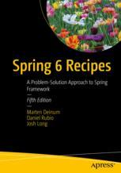

# Apress Source Code

This repository accompanies [*Spring 6 Recipes*](https://link.springer.com/book/10.1007/978-1-4842-8649-4) by Marten Deinum, Daniel Rubio, and Josh Long (Apress, 2023).

[comment]: #cover

Download the files as a zip using the green button, or clone the repository to your machine using Git.

## Releases

Release v1.0 corresponds to the code in the published book, without corrections or updates.

## Contributions

See the file Contributing.md for more information on how you can contribute to this repository.

## Prerequisits 

1. Installation of Java 19
2. https://gradle.org[Gradle] installed (or use the Gradle Wrapper shipped with the project)
3. (Optional) Your favorie IDE like:
   * https://www.jetbrains.com/idea/[IntelliJ IDEA]
   * Spring Tools[https://spring.io/tools] (can be used with Eclipse, VSCode or Theia
   * Or your favorite text editor
4. (Recommended) https://docker.com[Docker] to run things like a database or deploy/test the web related recipes
## Using the source code
The source is shipped as a working https://gradle.org[Gradle] build, if your IDE supports Gradle there is an option to import it into your IDE.

## Build recipes
To build all the recipes run `./gradlew build` from the main directory. This will download all the dependencies and build all the recipes.